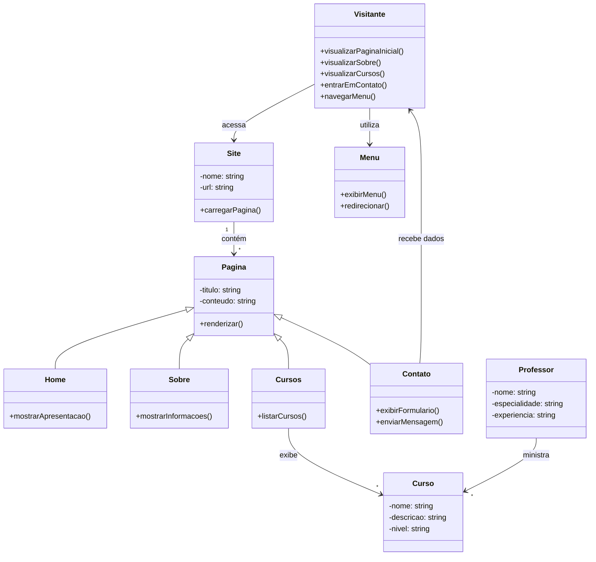

````md id="umlclass02"
# 📊 Diagrama UML (Classes) - Baseado nos Casos de Uso

## 📌 Descrição
Este diagrama de classes representa a estrutura do sistema com base nas ações do usuário (Visitante), conforme definido no diagrama de casos de uso.

## 🧩 Diagrama (Mermaid)


```
