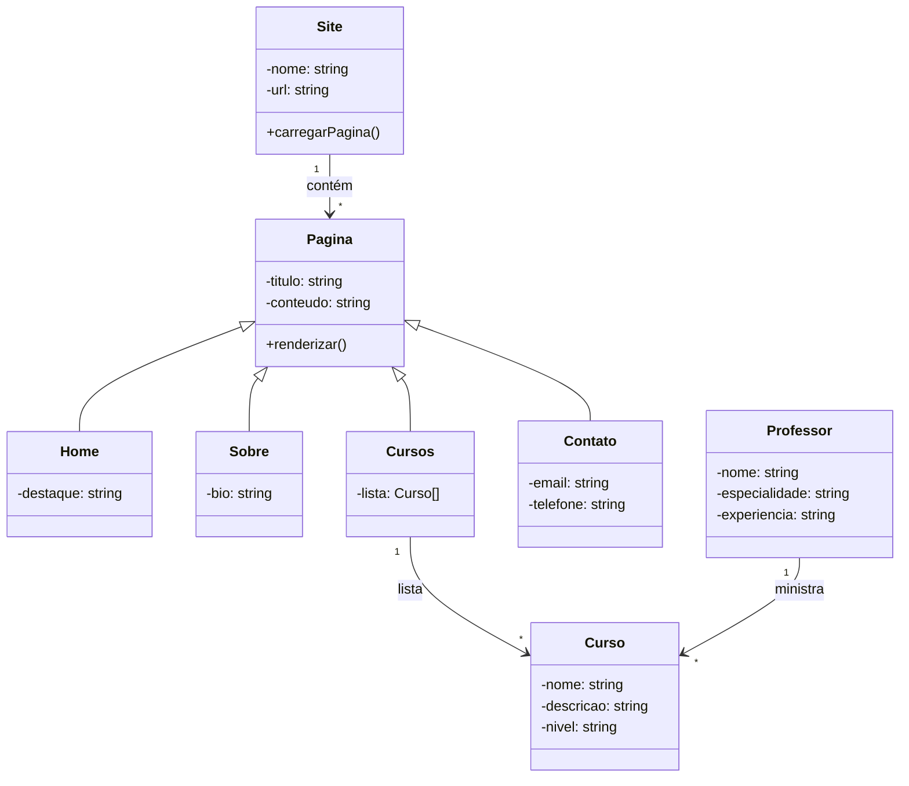

````md
# 📊 Diagrama UML - Sistema do Professor Rafael Alves

## 🧩 Diagrama de Classes


```mermaid
classDiagram

class Site {
  -nome: string
  -url: string
  +carregarPagina()
}

class Pagina {
  -titulo: string
  -conteudo: string
  +renderizar()
}

class Home {
  -destaque: string
}

class Sobre {
  -bio: string
}

class Cursos {
  -lista: Curso[]
}

class Contato {
  -email: string
  -telefone: string
}

class Curso {
  -nome: string
  -descricao: string
  -nivel: string
}

class Professor {
  -nome: string
  -especialidade: string
  -experiencia: string
}

Site "1" --> "*" Pagina : contém

Pagina <|-- Home
Pagina <|-- Sobre
Pagina <|-- Cursos
Pagina <|-- Contato

Cursos "1" --> "*" Curso : lista

Professor "1" --> "*" Curso : ministra
````

```
```